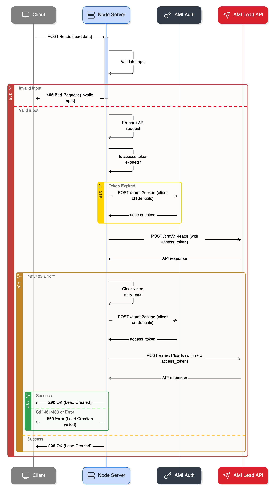

# AM-I OAuth2 Lead Creation Client

A sample Node.js server-side application for authenticating with AM-I Data Ingestion using OAuth 2.0 client credentials flow and creating leads.

---

## Flow Diagrams

### Sequence Diagram: Node.js Server Lead Creation Flow with OAuth2.0 Token Handling



### Flow Chart: Node.js Server Lead Creation Flow with OAuth2.0 Token Handling


## Architecture Overview

This application demonstrates a complete OAuth 2.0 client credentials flow implementation with the following components:

- **AmiApiClient Class**: Handles OAuth2 authentication and API interactions
- **Express Server**: Provides REST API endpoints for lead creation
- **Token Management**: Automatic token refresh with 60-second buffer
- **Error Handling**: Retry logic for 401/403 errors with token refresh
- **Request/Response Logging**: Full request/response logging for debugging

### OAuth2 Flow Implementation

1. **Client Credentials Grant**: Uses client ID and secret to obtain access tokens
2. **Token Caching**: Stores tokens in memory with expiration tracking
3. **Automatic Refresh**: Refreshes tokens before expiration (60s buffer)
4. **Retry Logic**: Automatically retries failed requests with fresh tokens

---

## Code Walkthrough

### OAuth2 Authentication (`AmiApiClient.getAccessToken()`)

```js
// 1. Check if current token is still valid
// 2. Create Basic Auth header from client credentials
// 3. POST to /oauth2/token with grant_type=client_credentials
// 4. Store token with expiration time (60s buffer)
```

### Lead Creation (`AmiApiClient.createLead()`)

```js
// 1. Get valid access token
// 2. POST lead data with Bearer token
// 3. Handle 401/403 errors with automatic retry
// 4. Clear invalid tokens and refresh
```

### Express Integration

```js
// 1. Environment-based configuration
// 2. Request validation and error handling
// 3. JSON response formatting
// 4. Health check and token status endpoints
```

---

## Installation

1. Clone or download this project
2. Install dependencies:

   ```bash
   npm install
   ```

3. Copy the environment template:

   ```bash
   cp .env.example .env
   ```

4. Edit `.env` file with your actual AM-I credentials (see below).

---

## Environment Setup

Create a `.env` file in your project root:

```env
# Required: Your AM-I API credentials
AMI_CLIENT_ID=your_actual_client_id
AMI_CLIENT_SECRET=your_actual_client_secret

# Optional: API endpoints (defaults to production)
AMI_BASE_URL=https://client-api.am-i.nl/public
AMI_AUTH_URL=https://external-api-auth.am-i.io

# Optional: Server configuration
PORT=3000
```

### Getting Your Credentials

1. Contact AM-I to obtain your Client ID and Client Secret
2. Ensure your application has the necessary API permissions
3. Test credentials using the `/token-status` endpoint

---

## Usage

### Start the server

```bash
npm start
```

For development with auto-restart:

```bash
npm run dev
```

### API Endpoints

#### 1. Health Check

```
GET /health
```

#### 2. Token Status

```
GET /token-status
```

#### 3. Create Lead

Add the fields that you want to create a lead
https://docs.am-i.io/#/ingestion/entities/lead

```
POST /leads
Content-Type: application/json

{
  "initiative": "Customer",
  "source": "autoverald",
  "leadType": "InformationRequest",
  "dealerId": "1234",
  "prospect": {
    "lastName": "Doe",
    "emailAddress": "john.doe@example.com"
  }
}
```

---

## Testing the Implementation

### Using the Test File

This project includes `test-requests.http` for easy testing:

1. **Install REST Client extension** in VS Code (or use curl)
2. **Start the server**: `npm start`
3. **Run test requests** from the `.http` file

### Manual Testing with curl

#### Check Authentication

```bash
curl http://localhost:3000/token-status
```

#### Create a Lead

```bash
curl -X POST http://localhost:3000/leads \
  -H "Content-Type: application/json" \
  -d '{
    "initiative": "Customer",
    "source": "autoverald",
    "leadType": "InformationRequest",
    "dealerId": "1234",
    "prospect": {
      "lastName": "Doe",
      "emailAddress": "john.doe@example.com"
    }
  }'
```

### Expected Responses

- **Token Status**: Shows if authentication is working
- **Lead Creation**: Returns lead ID and confirmation
- **Error Handling**: Clear error messages for debugging

---

## Troubleshooting

### Common Issues

#### Authentication Errors

- **401 Unauthorized**: Check your Client ID and Secret
- **403 Forbidden**: Verify your application has the required permissions
- **Token refresh failures**: Check network connectivity to auth server

#### API Errors

- **400 Bad Request**: Validate your lead data format
- **500 Internal Server Error**: Check server logs for detailed error messages

#### Debugging Tips

1. **Enable logging**: The app logs all requests/responses by default
2. **Check token status**: Use `/token-status` to verify authentication
3. **Monitor network**: Use browser dev tools or curl verbose mode
4. **Environment variables**: Ensure all required env vars are set

### Logs to Watch For

```
fetching new token          # Token refresh happening
First attempt failed...     # Retry logic triggered
Request/Response logs       # Full API interaction details
```

---

## Integration Guide

### Adapting for Your Use Case

#### 1. Replace Lead Creation

```js
// Replace the createLead method with your API endpoint
async yourApiCall(data) {
  const token = await this.getAccessToken();
  const response = await axios.post(
    `${this.baseUrl}/your/endpoint`,
    data,
    {
      headers: {
        Authorization: `Bearer ${token}`,
        "Content-Type": "application/json",
      },
    }
  );
  return response.data;
}
```

#### 2. Add More Endpoints

```js
// Add new Express routes following the same pattern
app.post("/your-endpoint", async (req, res) => {
  try {
    const result = await amiApiClient.yourApiCall(req.body);
    res.json({ success: true, data: result });
  } catch (error) {
    res.status(500).json({ success: false, error: error.message });
  }
});
```

#### 3. Customize Error Handling

```js
// Modify the retry logic for your specific needs
if (statusCode === 401 || statusCode === 403) {
  // Your custom retry logic
}
```

---

## Security Best Practices

### Credential Management

- ✅ Use environment variables for all secrets
- ✅ Never commit `.env` files to version control
- ✅ Use different credentials for dev/staging/production
- ❌ Don't hardcode credentials in source code
- ❌ Don't log sensitive information

### Production Considerations

- Use HTTPS in production
- Implement rate limiting
- Add request validation middleware
- Set up proper logging and monitoring
- Consider using a secrets management service

---

## Development

### Project Structure

```
amio-oauth-client-sample/
├── server.js          # Main application file
├── package.json       # Dependencies and scripts
├── .env              # Environment variables (create from .env.example)
├── .env.example      # Environment template
├── .gitignore        # Git ignore rules
└── README.md         # This file
```

### Scripts

- `npm start`: Start the server
- `npm run dev`: Start with nodemon for development

## Support

For issues related to AM-I API, please refer to their official documentation or contact their support team.
https://docs.am-i.io/#/ingestion/authentication
